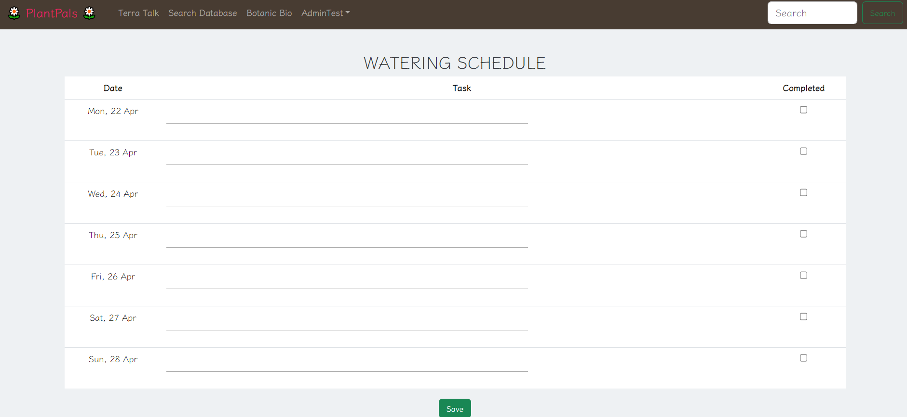
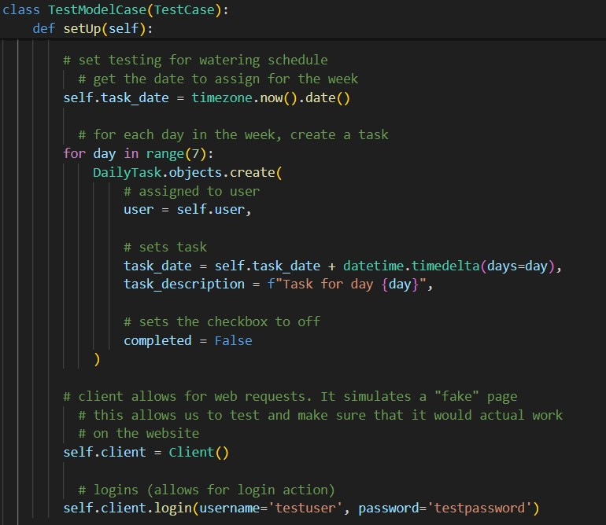

## 1\. Introduction ##

Plant Pals is a website built for house plant lovers of all kinds, from experienced gardeners to novice succulent owners who want to effectively care for their leafy friends. Without a website like Plant Pals, it can be difficult for greenery enthusiasts to find accurate care facts and as for advice from other plant owners. The fundamental goal of Plant Pals is to help plant owners grow (and not kill their plants) by providing information and a community that gives everyone a green thumb! 

The three key features of Plant Pals are the plant profiles, a plant database, and discussion boards. The plant profiles are a space for registered users to upload the photos and names of their plants, and create a watering schedule. Users can register by making an account, with a unique username, password, and email. The plant database is a searchable index of plant information, which includes the same facts for each plant. These details are all standardized to be the most critical facts for plant care, such as light and water requirements. Both account holders and guests have access to the database. The final functionality is the discussion boards. These will help build a community for registered users to ask questions and discuss ideas. Signed-in users can post, comment on posts, or even comment on comments, promoting conversation between users. These discussions are a useful resource for plant owners who want to correspond with those who have shared interests, spread valuable information, or find support. With these three functionalities, Plant Pals can create a supportive environment for plant owners to thrive.

## 2\. Implemented requirements ##

#### Requirement: #### 
>As someone wanting to learn about plants, I want to be able to look up plants with a simple search so that I can easily find what I need without hassle.

- Issue: <https://github.com/ao994/plant-pals/issues/40> 
- Pull request: <https://github.com/ao994/plant-pals/pull/112> (specifically the part with search implementation)
- Implemented by: Alyssa Ortiz
- Approved by: Andy Ortega
  
Print screen: 

#### Requirement: 
>As a novice plant owner, I want to view and access plant information about plant care to keep my plants alive.
- Issue: <https://github.com/ao994/plant-pals/issues/29> 
- Pull request: <https://github.com/ao994/plant-pals/pull/112> (specifically the part with the database and specific plant pages)
- Implemented by: Alyssa Ortiz
- Approved by: Andy Ortega
  
Print screen: 

#### Requirement: 
>As a plant owner, I want to be able to keep track of my plant's watering schedule so I can make sure they have been watered and are not being overwatered.
- Issue: <https://github.com/ao994/plant-pals/issues/126> 
- Pull request: <https://github.com/ao994/plant-pals/pull/109> 
- Implemented by: Haley Berger
- Approved by: Andy Ortega
  
Print screen: 

#### Requirement: 
>As a new user, I want to be able to easily find what I am looking for on the website so that I don't get lost and give up.
- Issue: <https://github.com/ao994/plant-pals/issues/32>
- Pull request:
[https://github.com/ao994/plant-pals/pull/84  ](https://github.com/ao994/plant-pals/pull/84)
& <https://github.com/ao994/plant-pals/pull/85>  
- Implemented by: Karissa Smallwood
- Approved by: Haley Berger
  
Print screen: 

#### Requirement: 
>As a new user with a profile, I want to have a unique username so that other people can easily differentiate me.
- Issue: <https://github.com/ao994/plant-pals/issues/136> 
- Pull request: <https://github.com/ao994/plant-pals/commit/74e7aad897df226b0b289e7b0b930c7c640c9210> 
- Implemented by: Alyssa Ortiz & Haley Berger & Alex King
- Approved by: Alyssa Ortiz (Because we were all working on it together, we did a direct commit to our launch test branch, which was then later committed to the main branch with some other implementations)

Print screen: 

## 3\. Tests 
**Example test case:**

The following is an example of one of our test cases. This test case specifically checks to ensure that the watering schedule works as it should (allowing the user to input information and mark if it has already been completed or not).

This is our fifth test case in tests.py. The process starts with a setup, proceeds to the validation and assertion, and then finishes with a cleanup.

Link to tests file: https://github.com/ao994/plant-pals/blob/main/Code/plant-pals/profile_of_user/tests.py

***Setup*** (creates a watering schedule object and sets up requirements for a Client test):

-   Django will first make a temporary database.

-   The test starts by determining the time and day of the system in order to assign days to the watering schedule. Following that, data is set up using our DailyTask model to get necessary testing information. A string is assigned to each day, as is a boolean that is used to determine if the task has been completed or not. In the initial setup, none of the tasks are completed.

-   Client is also set up; this allows us to create a "fake" interactable version of our website that the test code can use. Client, from here on out, can be considered a fake user. We then log in Client, that way it can interact with parts of the website only available to logged-in users. In this case, the watering schedule is on a user's profile, which is only accessible to a logged-in user and thus makes logging in Client necessary.

***Data validation/assertion*** (confirms that the information is interactable as expected and properly saved):

-   To test a page, we needed to tell the program what page we want to test. Doing so allows the software to know what it can access. From there, we set the information that we want to attempt to insert. This uses information from setup, marking every other task as completed, and ensuring that the tasks can be updated.

-   Client then accesses the designated part of the website with the information we set up. This is our "black box". We can only send input (the previously defined information) and receive output from the call. The result of the call (our output) ensures that the page was accessed as expected and that the data was saved. We then looked to see if the newly saved data was what we expected. This uses the functions in view.py for testing with the fake website.

***Cleanup*** (gets rid of the watering schedule object because it is not needed in other test cases):

-   Due to the watering schedule not being needed in other test cases, we can go ahead and get rid of it.

-   After all the tests are completed, Django will get rid of the temporary database it made for testing purposes.

***Results***: 

Each '.' represents a successful run of a single test case. There are eight '.' because we have eight test cases. If one presented an error, the '.' would be replaced with an 'E'. If one presented a failure, the '.' would be replaced with an 'F'. The results presented show successful test runs.

**Additional Tests**: Aside from the test case provided above and those mentioned in D4 (for plant, posts, replies, and profile), test cases for a unique username, plant search functionality, and plant search results have also been made.

## 4\. Demo
Here is the link to our demo!

<https://youtu.be/Dfu_dMSZjZY>

## 5\. Code quality

Our team managed code quality by implementing our own form of the General Usage Rubric.  We have had many experiences with it from our previous classes and felt that it could help us with our coding standards.  Some requirements implemented include: an 80 character limit, spacing and bracket alignment (within reason, under given circumstances), and no functions in a return statement. These were incorporated so that our code could be read properly, and we could follow the flow of the code.

#### 1.  All variables must be self-documenting. 
Reason: If someone wants to go through and change something, we need to be able to easily identify what to change.

#### 2.  Formatting must be consistent. 
Reason: We want to be able to easily find what we are looking for. If code is inconsistently formatted, that would be difficult. This includes, in general, keeping lines to 80 characters and keeping up with bracket alignment.

#### 3.  Follow logic. Don't do something in a roundabout way even if it is easier to code. Make it easy to follow. 
Reason: We want to be able to understand the code when looking at it.

#### 4.  No using break unless necessary. 
Reason: There are very few circumstances where break is needed. It's best to avoid it to keep logic consistent.

#### 5.  Avoid global variables. 
Reason: We really should not need them and it would be hard to track them through code. We want things to be easy to read through in order to easily identify errors.

#### 6.  Keep to using true or false rather than 1 or 0. 
Reason: General readability. Makes it easier/faster to understand and track. This also helps with consistency.

#### 7.  No use of continue. 
Reason: There is no reason we should use this and it would just break up code readability.

In addition to those code requirements, we also mandate the use of a pre-main branch titled 'launch-test'. In this branch, Alex will first test it in his live environment. If it works, it will then be tested on the live server. If that works, it will then be pushed to main. This is done to ensure that everything in main is 100% functional. We also require code reviews for all new code pushed to launch tests through pull requests. We have found that this helps us catch early errors and also helps make sure the team knows what new code is being added.

## 6\. Lessons learned
The team learned many different things when developing the second release of this project. We learned more about how to incorporate a variety of different plant types into a database and, in general, use an SQL-based database. This allows for users to be able to look up any plant that they are interested in. With that, we also learned how to incorporate a search bar onto our website. We also learned how to create user-associated classes, such as that for the watering schedule. The watering schedule itself was its own class with information that was then connected to each user, creating a unique additional set of information separate from the user's profile class, but still associated with it on an individual case. We learned a lot from the Django documentation (<https://docs.djangoproject.com/en/5.0/>) and general research to incorporate this.

Despite learning a lot during this release, the team noticed that our communication could still use some work. There have been occasions where a member would end up waiting a long time for someone to accept their request. Not only is this inconvenient, but it has delayed our progress. Besides that one issue, our group has been putting their all into continuing to learn more about what it takes to be a Software Engineer.
