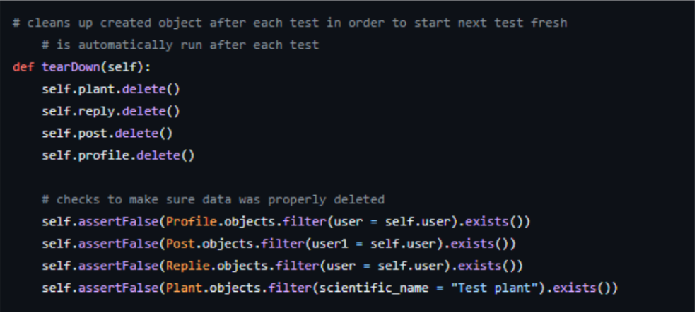
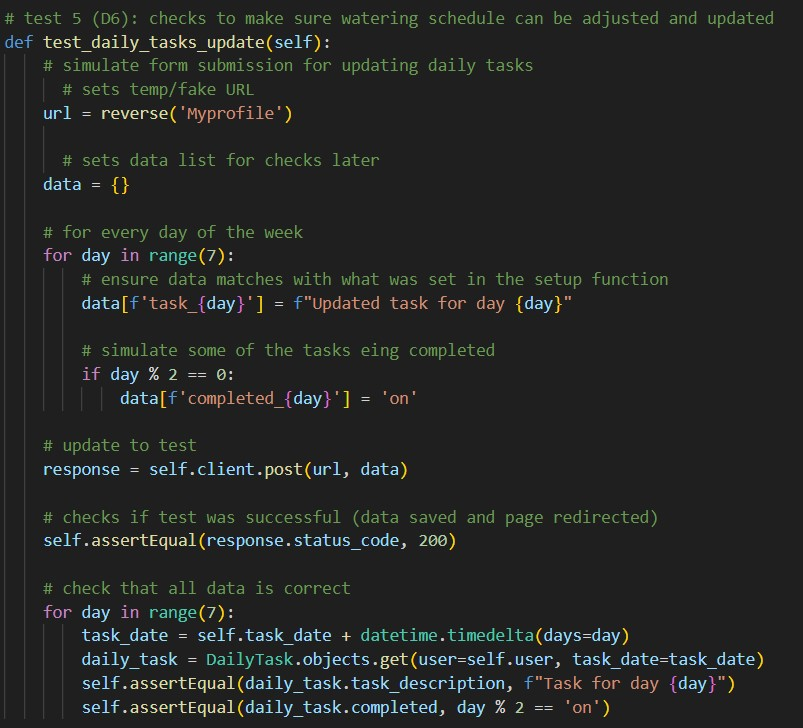
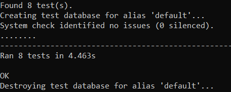

## 1\.Description
The Plant Pals website will be centered around three key functionalities: profiles, a plant database, and user discussion boards. When users make an account with the website, they will create a unique username and password. Once this is completed, they can then activate their account by verifying it with their email. The website will also include a password recovery system, in case the user forgets their password and wants to log back in. On an account, a user can create a profile of their plants with names and pictures of each. All of these pieces of information can be changed, updated, or removed later as long as the user is signed in. This information must also be secure, as it includes personal details. A user can also create a plant watering schedule if desired. Plant Pals may also include a follow, or ‘Pal’, feature. The plant database is an essential feature of the Plant Pals website. The database will contain the essential information on how to care for your plants, such as light requirements, watering needs, and optimal humidity levels. This data is searchable with an easy-to-use search engine that provides accurate information. There is a feedback feature to report inaccuracies or request additional information be added. A user can access the search engine whether or not they are signed into an account. 

Discussion boards are a standout feature of the website, allowing users to build a community. Signed-in users can make dashboards for broad subjects. On these dashboards, these users can also make posts asking questions, giving plant updates, or sharing information. Posts have comments sections, where logged-in users can make comments about the post or even other comments with answers, further questions, or other contributions. A user who is not logged in cannot interact with a dashboard, but can observe it. These dashboards must be monitored by logged in moderators who can take down comments and posts that are not consistent with the values of the website. The dashboards as a whole provide a way for users to correspond with others who have similar interests to share valuable information and support. 

## 2\. Verification (tests)

Django has its own test structure that first calls a setup function, followed by a specified test function, and ends with the cleanup function. The setup function and cleanup function do not need to be used for every test case, but it does make things easy when data should be completely disregarded before the next test case begins. For more information on the specifics of how the test structure works, please refer to:
- Django Documentation: <https://docs.djangoproject.com/en/5.0/topics/testing/>
- D4 (Implementation 1): <https://github.com/ao994/plant-pals/blob/main/Deliverables/Submitted/Implementation%20(D4)/implementation.md>
  
More information about the specifics of how it runs can be found there.

#### Test File Links:
###### GitHub automated test file:
<https://github.com/ao994/plant-pals/blob/main/Code/plant-pals/profile_of_user/tests.py>

###### Class file link (contains structures for database storage):
<https://github.com/ao994/plant-pals/blob/main/Code/plant-pals/profile_of_user/models.py>

###### Views file link (contains functional Python code for actions): 
<https://github.com/ao994/plant-pals/blob/main/Code/plant-pals/profile_of_user/views.py> 

#### Unit Test
- Test Framework: TestCase - a subclass of UnitTest developed by/for Django. 

#### Example Test Case:
This test case specifically checks that an individual part of our code (in this case, our Plant model), stores and interacts properly with the database. This is to test for possible data loss or bugs.

#### Setup (creates a new mock object (a new/test plant) using our Plant model):
- This also adds it to a temporary database created by Django for unit testing to ensure it acts as expected. 

#### Data validation/assertion (confirms that the information in the database matches the information assigned): 

#### Cleanup (removes the added database information to prepare for next test/ confirm that information is properly removed when deleted): 

#### Acceptance Test
- Test Framework: Client - a subclass of TestCase. It has a special feature to do its own form of acceptance testing.

#### Example Test Case:
This test case specifically checks to ensure that the watering schedule works as it should (allowing the user to input information and mark if it has already been completed or not).

#### Setup (creates a watering schedule object and sets up requirements for a Client test):
- Django will first make a temporary database.
- The test starts by determining the time and day of the system in order to assign days to the watering schedule. Following that, data is set up using our DailyTask model to get necessary testing information. A string is assigned to each day, as is a boolean that is used to determine if the task has been completed or not. In the initial setup, none of the tasks are completed.
- Client is also set up; this allows us to create a “fake” interactable version of our website that the test code can use. Client, from here on out, can be considered a fake user. We then log in Client, that way it can interact with parts of the website only available to logged-in users. In this case, the watering schedule is on a user's profile, which is only accessible to a logged-in user and thus makes logging in Client necessary.

#### Data validation/assertion (confirms that the information is interactable as expected and properly saved):
- To test a page, we needed to tell the program what page we want to test. Doing so allows the software to know what it can access. From there, we set the information that we want to attempt to insert. This uses information from setup, marking every other task as completed, and ensuring that the tasks can be updated.
- Client then accesses the designated part of the website with the information we set up. This is our “black box”. We can only send input (the previously defined information) and receive output from the call. The result of the call (our output) ensures that the page was accessed as expected and that the data was saved. We then looked to see if the newly saved data was what we expected. This uses the functions in view.py for testing with the fake website.

#### Cleanup (gets rid of the watering schedule object because it is not needed in other test cases):
- Due to the watering schedule not being needed in other test cases, we can go ahead and get rid of it.
- After all the tests are completed, Django will get rid of the temporary database it made for testing purposes.
  

### Full Results (applicable for unit and acceptance testing): 

Each ‘.’ represents a successful run of a single test case. There are eight ‘.’ because we have eight test cases. If one presented an error, the ‘.’ would be replaced with an ‘E’. If one presented a failure, the ‘.’ would be replaced with an ‘F’. The results presented show successful test runs.

#### Additional Tests: 
Aside from the test case provided above, test cases for a unique username, plant search functionality, and plant search results have also been made. We also have a test case for all other models like Posts, Replies, and Profile.

## 3\. Validation (user evaluation)

#### General Introduction of us and the project:
Hi [user], I’m interviewing you about Plant Pals which is the project that my group and I have been working on. Plant Pals is a website built for and by plant owners to make plant care easier. The point of this interview is to get a consensus about the feel and use of the website. I have a list of tasks I would like for you to attempt to carry out on the website. Please be sure to voice all of your opinions on any detail as we go through the list!

#### User Tasks:
1) Sign up for an account
2) Add a plant (image and name)
3) Add to your watering schedule
4) Search for rosemary
5) Make a discussion post
6) Log out
7) Log back into your account

#### INTERVIEW 1:

Who was interviewed and who participated: Andy interviewed Jordan   
When: 4/28/24 

What initially caught your eye upon opening the website?   

- The cute earthy design caught my eye at first.   

Which task did you find most difficult? Why?   

-   Most of it was pretty explanatory but id probably have to say putting the plant in.   

Was there any feature that you didn't notice initially?   

-   Figuring out where to put the watering system but only because I didn't see it at the bottom.   

What was the most difficult part of signing up?   

-   It was pretty simple and wasn't too difficult.   

Did you have any difficulties making your profile or watering schedule?   

-   I did not have any difficulties making or putting in my watering schedule.   

Was there any color or design choices that stood out to you? In what way?   

-   The whole website because it was very much earth tones and made you know it was a plant website.   

What was the best feature?   

-   The questions so people could help you out if need be.   

 What was the worst feature?   

-   Nothing, everything was pretty simple and easy to use.

Which buttons were difficult to find? 

-   All buttons were easy to find and weren't too difficult to find.

#### INTERVIEW 2: 

Who was interviewed and who participated: Alyssa interviewed Justin  
When: 4/28/24 

- What initially caught your eye upon opening the website?
“I really like the color scheme, it was really plant-like. It gave good plant vibes.”
- Which task did you find most difficult? Why?
Adding a plant to the profile, it was confusing because I initially wanted to edit the large display area, and didn’t realize that I had to do it in a small thing at the top.
- Was there any feature that you didn’t notice initially?
No, everything was where I expected it to be.
- What was the most difficult part of signing up?
Thinking of a password, everything was super easy.
- Did you have any difficulties making your profile or watering schedule?
No, water schedule was super easy.
- Were there any color or design choices that stood out to you? In what way?
I really liked the plant background for all of the pages!
- What was the best feature?
The search worked really well.
- What was the worst feature?
Editing the profile, because it was not where I expected it to be.
- Which buttons were difficult to find? 
The discussion board, having to click directly on the name to get to the reply post area was confusing, as I assumed that it would take me directly to that persons profile page instead.

#### INTERVIEW 3: 

Who was interviewed and who participated: Karissa interviewed Susie  
When: 4/28/24 

INTERVIEW NOTES

What initially caught your eye upon opening the website?

-   I immediately noticed that the front page is the discussion board, which provides a description of the purpose of the discussion board, which I thought was cool. I liked that I could immediately see the thoughts of different site users. 

Which task did you find most difficult? Why?

-   The most difficult task was entering in my user & plant information because it took me a second to understand that the corresponding images were on the bottom of the page, and I didn't realize that there were two different buttons to save your profile info & plant info, so I filled it all out, hit upload "upload avatar", and lost everything I had added for my plant & had to re-input the info. 

Was there any feature that you didn't notice initially?

-   I didn't initially see the watering schedule

 What was the most difficult part of signing up?

-   I don't think there was anything difficult about signing up, but maybe having a homepage with a spot prompting you to sign in/sign up would help any confusion that someone may have?

 Did you have any difficulties making your profile or watering schedule?

-   The only difficulty I had was what I shared in the question above about the different buttons for the plant & personal info.

Were there any color or design choices that stood out to you? In what way?

-   I noticed the usage of a rose design for the sign up page, I noticed the mountains from the log-in page, which I thought was interesting for a plant website. I noticed the usage of green and brown to represent plants, and a red color for the website title in the corner as well as the usernames in the discussion forum, which helps it stand out as it is green's compliment. 

What was the best feature?

-   I really like the search feature, especially since I looked up more plants than just "rosemary", and they all came up and provided useful information!

What was the worst feature? 

-   The watering schedule might be the worst feature because I think its design of it could be adjusted to become more useful, maybe making it more like a checklist so you can add more plants to the watering schedule.

Which buttons were difficult to find? 

-   It took me a second to register that "Terra Talk" was the discussion forum, so I would say that that was the most difficult button to find.
